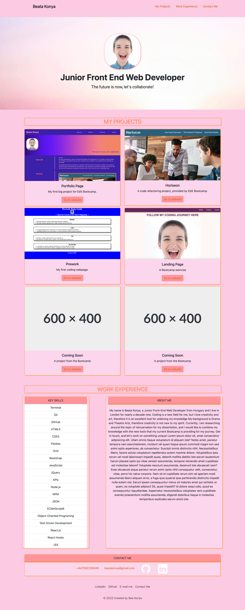
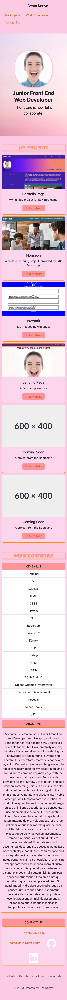

# Beata Konya's Bootstrap Portfolio

# Description

Beata Konya's Bootstrap Portfolio was designed to showcase the knowledge that I have utilised during my bootcamp experience with EdX. The webpage was created with bootstrap attributes.

Overview of the project:
* Created the repo with the name "bootstrap-portfolio" as it was requested by the Challenge.
* Used Bootstrap's navigation bar code for a user-friendly navigation system.
* Customized the navigation menu with strategically placed links to relevant sections on page.
* Developed a visually appealing jumbotron for the hero section.
* Added a picture, name, and personalized information for an engaging introduction of the page.
* Utilized Bootstrap cards for a grid layout showcasing projects, included project overview, serving with a link to the projects.
* Listed anticipated skills to be gained from the bootcamp.Created an About Me segment within the same row.
* Integrated hyperlinks in the contact me/ footer/nav section with hover effects, also added box shadow effects to the buttons.
* Minimized the use of media queries for a consistent experience across devices.

## Table of Contents

<!-- vscode-markdown-toc -->
*  [Deployed Page](#DeployedPage)
*  [Installation](#Installation)
*  [Usage](#Usage)
*  [Credits](#Credits)
*  [License](#License)

<!-- vscode-markdown-toc-config
	numbering=true
	autoSave=true
	/vscode-markdown-toc-config -->
<!-- /vscode-markdown-toc -->

## Deployed Page

[Link to Deployed Github Page](https://beatak777.github.io/bootstrap-portfolio/)

## Installation

No Installation necessary. 

## Usage

No Usage necessary.

## Credits

- Special thanks to Laura, EdX Bootcamp Tutor for providing us the detailed Skills list.

- Special thansk to [Bootstrap](https://getbootstrap.com/docs/5.3) for providing the code snippets in order for this webpage to fully function.

- Study materials provided by [edX Bootcamp](https://www.edx.org/course/skills-bootcamp-in-front-end-web-development).

- Special thanks to [SheCodes](https://cheatsheets.shecodes.io/cheatsheets/bootstrap) for providing Bootstrap cheatsheet that helped me during my head scratching moments.

- Table of Contents was Created with the Visual Studio Code Extension 'Markdown TOC' available [here](https://marketplace.visualstudio.com/items?itemName=dumeng.markdown-toc).

- Special thanks for the Github and Linkedin logos from [Icons8](https://icons8.com/icons).

- Page created by [Bea Konya](https://github.com/beatak777).

## License

Please refer to the LICENSE in the repo.